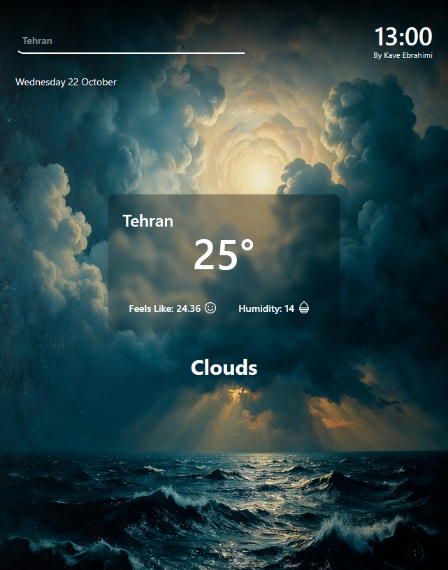

# 🌤️ Mini Weather App


A modern **React Weather App** built using **Redux, Redux-Saga, Axios, GSAP**, and **TailwindCSS**.  
Fetches weather data from the **[OpenWeather API](https://openweathermap.org/api)**.  
It allows users to **search for any city or country**, displaying **real-time weather details** such as temperature, humidity, feels-like temperature, and current date & time with smooth animations.

---

## 🚀 Features

- 🌍 Search for any **city or country**  
- 🕒 Displays **real-time date and time**  
- 🌡️ Shows **temperature, humidity, and feels-like** values  
- 🌦️ Dynamic **background changes** based on weather condition  
- ⚡ Powered by **Redux + Redux-Saga** for state management  
- 🎬 Smooth **GSAP animations** for UI transitions  
- 💅 Fully responsive with **TailwindCSS**

---

## 📸 Screenshots



---

## 🌐 Live Demo

[Live Demo](https://kavebrahimi.github.io/React-weather/)

---

## 💻 Installation

1. Clone the repository:

```bash
git clone https://github.com/Kavebrahimi/React-weather.git
cd React-weather
